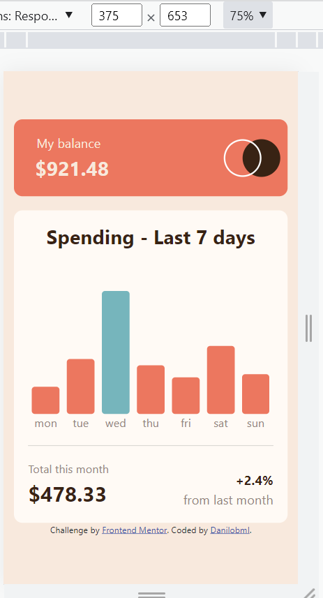

# Frontend Mentor - Expenses chart component solution

This is a solution to the [Expenses chart component challenge on Frontend Mentor](https://www.frontendmentor.io/challenges/expenses-chart-component-e7yJBUdjwt). Frontend Mentor challenges help you improve your coding skills by building realistic projects.

## Table of contents

- [Overview](#overview)
  - [The challenge](#the-challenge)
  - [Screenshot](#screenshot)
  - [Links](#links)
- [My process](#my-process)
  - [Built with](#built-with)
  - [What I learned](#what-i-learned)
  - [Continued development](#continued-development)
  - [Useful resources](#useful-resources)
- [Author](#author)
- [Acknowledgments](#acknowledgments)

## Overview

It was an interesting practice! I'm happy that I was able to finish in one afternoon. Sizing is still challenging - if you have any tips to improve, I'd really appreciate that!

### The challenge

Users should be able to:

- View the bar chart and hover over the individual bars to see the correct amounts for each day
- See the current day’s bar highlighted in a different colour to the other bars
- View the optimal layout for the content depending on their device’s screen size
- See hover states for all interactive elements on the page
- **Bonus**: Use the JSON data file provided to dynamically size the bars on the chart

### Screenshot

### Links

- Solution URL: (https://github.com/danilobml/fem-expenses-chart-component)
- Live Site URL: (https://danilobml.github.io/fem-expenses-chart-component/)

## My process

### Built with

- HTML5
- CSS 3 and custom properties
- JavaScript
- [Bootstrap 5](https://getbootstrap.com/) - Mainly for responsivity, but also some styling.

### What I learned

It was challenging to do the dynamic bars and day names, but especially the value displayed on top on the hover. Sizing is still quite a challenge, and I never seem to get it perfectly right.

### Continued development

I want to learn how to do sizing better.

### Useful resources

- [Stack Overflow](https://stackoverflow.com/) - My go-to reference for most things.
- [W3 Scools](https://www.w3schools.com/howto/howto_css_display_element_hover.asp) - This page helped me with the onhover display of the values.

## Author

- Website - [Danilobml](https://github.com/danilobml)
- Frontend Mentor - [@danilobml](https://www.frontendmentor.io/profile/danilobml)

## Acknowledgments

As always, I'd like to thank my friend and teacher Ben from WBS codeing school.
